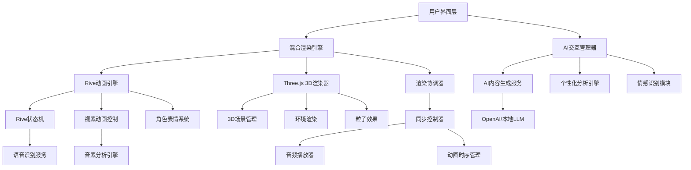

# 3D AI导师Lumi设计文档

## 概述

3D AI导师Lumi系统将现有的2D吉祥物升级为具备智能交互能力的3D角色。基于多邻国使用Rive的成功经验，系统采用**Rive + Three.js混合架构**：Rive负责高效的2D/2.5D角色动画和对口型同步，Three.js处理3D场景渲染，并集成AI技术生成个性化的学习反馈和记忆故事。这种方案既保证了动画质量和性能，又实现了可扩展的多语言对口型支持。

## 架构设计

### 系统架构图（基于Rive + Three.js混合方案）



### 核心组件

1. **混合渲染层**: 协调Rive 2D动画和Three.js 3D场景
2. **Rive动画层**: 处理角色动画、表情和对口型（参考多邻国方案）
3. **3D场景层**: 处理环境渲染和3D效果
4. **AI交互层**: 处理智能对话、点评和故事生成
5. **同步控制层**: 协调语音、动画和交互的时序
6. **数据管理层**: 存储用户偏好和学习数据

### 技术栈选择理由

基于多邻国的成功经验，我们选择Rive作为核心动画引擎的原因：

1. **文件大小优势**: Rive文件比传统动画文件小得多，适合Web部署
2. **状态机系统**: 可编程控制动画状态转换，支持复杂的交互逻辑
3. **可扩展性**: 支持多语言、多角色的视素动画，无需手动制作每个组合
4. **性能优化**: 实时渲染，响应用户交互，支持动态停止和切换
5. **工作流整合**: 设计师到工程师的无缝交接

## 组件和接口设计

### 1. 3D角色渲染组件

```typescript
interface LumiRenderer {
  // 初始化3D场景
  initializeScene(): void;
  
  // 加载Lumi 3D模型
  loadCharacterModel(modelPath: string): Promise<void>;
  
  // 更新角色表情
  updateFacialExpression(emotion: EmotionType): void;
  
  // 播放身体动画
  playBodyAnimation(animationType: AnimationType): void;
  
  // 设置角色位置和朝向
  setCharacterPose(position: Vector3, rotation: Vector3): void;
}

interface EmotionType {
  happiness: number;    // 0-1
  surprise: number;     // 0-1
  concern: number;      // 0-1
  excitement: number;   // 0-1
}
```

### 2. 对口型同步组件（基于Rive技术栈）

```typescript
interface LipSyncEngine {
  // 分析语音音素（参考多邻国方案）
  analyzePhonemes(audioBuffer: ArrayBuffer): Promise<PhonemeData[]>;
  
  // 生成视素（Viseme）映射
  generateVisemeMapping(phonemes: PhonemeData[]): VisemeSequence[];
  
  // 控制Rive状态机
  controlRiveStateMachine(visemes: VisemeSequence[]): void;
  
  // 同步播放语音和口型
  syncAudioWithVisemes(audio: HTMLAudioElement, visemes: VisemeSequence[]): void;
  
  // 停止同步播放
  stopSync(): void;
}

interface PhonemeData {
  phoneme: string;
  startTime: number;
  duration: number;
  intensity: number;
  language: string;  // 支持多语言音素
}

interface VisemeSequence {
  time: number;
  visemeType: VisemeType;  // 20+种嘴型状态
  duration: number;
  blendWeight: number;     // 状态混合权重
}

// 基于多邻国经验的视素类型
enum VisemeType {
  SILENCE = 'silence',
  AA = 'aa',      // 如 'father'
  AE = 'ae',      // 如 'cat'
  AH = 'ah',      // 如 'but'
  AO = 'ao',      // 如 'thought'
  EH = 'eh',      // 如 'bed'
  ER = 'er',      // 如 'bird'
  IH = 'ih',      // 如 'bit'
  IY = 'iy',      // 如 'beat'
  OW = 'ow',      // 如 'boat'
  UH = 'uh',      // 如 'book'
  UW = 'uw',      // 如 'boot'
  B_M_P = 'bmp',  // 双唇音
  CH_J_SH = 'chjsh', // 舌面音
  D_S_T = 'dst',  // 舌尖音
  F_V = 'fv',     // 唇齿音
  G_K = 'gk',     // 舌根音
  L = 'l',        // 舌侧音
  N_NG = 'nng',   // 鼻音
  R = 'r',        // 卷舌音
  TH = 'th',      // 舌齿音
  W = 'w',        // 半元音
  Y = 'y'         // 半元音
}
```

### 3. AI内容生成组件

```typescript
interface AIContentGenerator {
  // 生成个性化点评
  generateFeedback(
    testResult: TestResult,
    userProfile: UserProfile
  ): Promise<FeedbackContent>;
  
  // 生成记忆故事
  generateMemoryStory(
    word: VocabularyWord,
    userContext: UserContext
  ): Promise<StoryContent>;
  
  // 分析用户学习模式
  analyzeUserPattern(learningHistory: LearningData[]): UserPattern;
}

interface FeedbackContent {
  text: string;
  emotion: EmotionType;
  suggestions: string[];
  encouragementLevel: number;
}

interface StoryContent {
  title: string;
  narrative: string;
  keyPoints: string[];
  memoryTriggers: string[];
}
```

### 4. 情感智能组件

```typescript
interface EmotionalIntelligence {
  // 分析用户情感状态
  analyzeUserEmotion(
    behaviorData: UserBehavior,
    performanceData: TestResult[]
  ): EmotionalState;
  
  // 选择合适的响应策略
  selectResponseStrategy(
    userEmotion: EmotionalState,
    context: InteractionContext
  ): ResponseStrategy;
  
  // 调整Lumi的情感表达
  adjustLumiEmotion(
    baseEmotion: EmotionType,
    strategy: ResponseStrategy
  ): EmotionType;
}
```

## 数据模型

### 用户配置模型

```typescript
interface UserProfile {
  id: string;
  learningStyle: 'visual' | 'auditory' | 'kinesthetic';
  preferredLanguage: string;
  culturalBackground: string;
  interactionPreferences: {
    lumiActivityLevel: number;    // 1-5
    feedbackFrequency: number;    // 1-5
    storyComplexity: number;      // 1-5
  };
  customization: {
    lumiAppearance: LumiAppearance;
    voiceSettings: VoiceSettings;
  };
}

interface LumiAppearance {
  colorScheme: string;
  size: number;
  expressiveness: number;
}
```

### 学习数据模型

```typescript
interface LearningSession {
  sessionId: string;
  userId: string;
  startTime: Date;
  endTime: Date;
  wordsStudied: VocabularyWord[];
  testResults: TestResult[];
  lumiInteractions: LumiInteraction[];
  emotionalJourney: EmotionalState[];
}

interface LumiInteraction {
  timestamp: Date;
  type: 'feedback' | 'story' | 'encouragement';
  content: string;
  userResponse: UserResponse;
  effectiveness: number;    // 1-5
}
```

## 错误处理

### 3D渲染错误处理

```typescript
class RenderingErrorHandler {
  // WebGL不支持时的降级策略
  handleWebGLUnsupported(): void {
    // 切换到2D Lumi显示
    this.fallbackTo2DMode();
    this.notifyUser('3D功能不可用，已切换到2D模式');
  }
  
  // 模型加载失败处理
  handleModelLoadError(error: Error): void {
    // 使用备用简化模型
    this.loadFallbackModel();
    this.logError('3D模型加载失败', error);
  }
  
  // 性能问题处理
  handlePerformanceIssue(): void {
    // 自动降低渲染质量
    this.reduceRenderQuality();
    this.optimizeAnimations();
  }
}
```

### AI服务错误处理

```typescript
class AIServiceErrorHandler {
  // AI服务不可用时的处理
  handleAIServiceDown(): void {
    // 使用预设的反馈模板
    this.useFallbackTemplates();
    this.scheduleRetry();
  }
  
  // 内容生成失败处理
  handleContentGenerationError(): void {
    // 使用缓存的相似内容
    this.useCachedSimilarContent();
    this.reportGenerationFailure();
  }
}
```

## 测试策略

### 单元测试

1. **3D渲染组件测试**
   - 模型加载和显示测试
   - 动画播放和控制测试
   - 性能基准测试

2. **对口型同步测试**
   - 音素识别准确性测试
   - 同步时序精度测试
   - 多语言支持测试

3. **AI内容生成测试**
   - 内容质量评估测试
   - 个性化准确性测试
   - 响应时间性能测试

### 集成测试

1. **端到端用户体验测试**
   - 完整学习流程测试
   - 多设备兼容性测试
   - 长时间使用稳定性测试

2. **性能集成测试**
   - 多组件协同性能测试
   - 内存使用优化测试
   - 网络延迟适应测试

### 用户体验测试

1. **可用性测试**
   - 新用户上手难度测试
   - 功能发现性测试
   - 错误恢复能力测试

2. **情感体验测试**
   - Lumi角色亲和力测试
   - 情感反馈适当性测试
   - 长期使用满意度测试

## 性能优化策略

### 3D渲染优化

1. **模型优化**
   - 使用LOD（细节层次）技术
   - 纹理压缩和优化
   - 几何体简化算法

2. **动画优化**
   - 关键帧插值优化
   - 动画缓存机制
   - 不可见时停止动画

3. **渲染优化**
   - 视锥剔除
   - 批量渲染
   - 着色器优化

### AI服务优化

1. **内容缓存策略**
   - 智能预生成常用内容
   - 分层缓存机制
   - 过期策略优化

2. **请求优化**
   - 批量请求处理
   - 异步内容生成
   - 优先级队列管理

## 安全和隐私

### 数据保护

1. **用户数据加密**
   - 本地数据AES加密
   - 传输数据HTTPS保护
   - 敏感信息脱敏处理

2. **AI服务安全**
   - API密钥安全管理
   - 请求频率限制
   - 内容过滤机制

### 隐私合规

1. **数据收集透明化**
   - 明确的隐私政策
   - 用户同意机制
   - 数据使用范围说明

2. **用户控制权**
   - 数据删除功能
   - 隐私设置选项
   - 数据导出功能

## 部署和维护

### 部署策略

1. **渐进式部署**
   - 功能开关控制
   - A/B测试支持
   - 灰度发布机制

2. **资源管理**
   - CDN加速3D资源
   - 智能资源预加载
   - 离线缓存策略

### 监控和维护

1. **性能监控**
   - 3D渲染性能指标
   - AI服务响应时间
   - 用户体验质量指标

2. **错误监控**
   - 实时错误报告
   - 用户反馈收集
   - 自动故障恢复