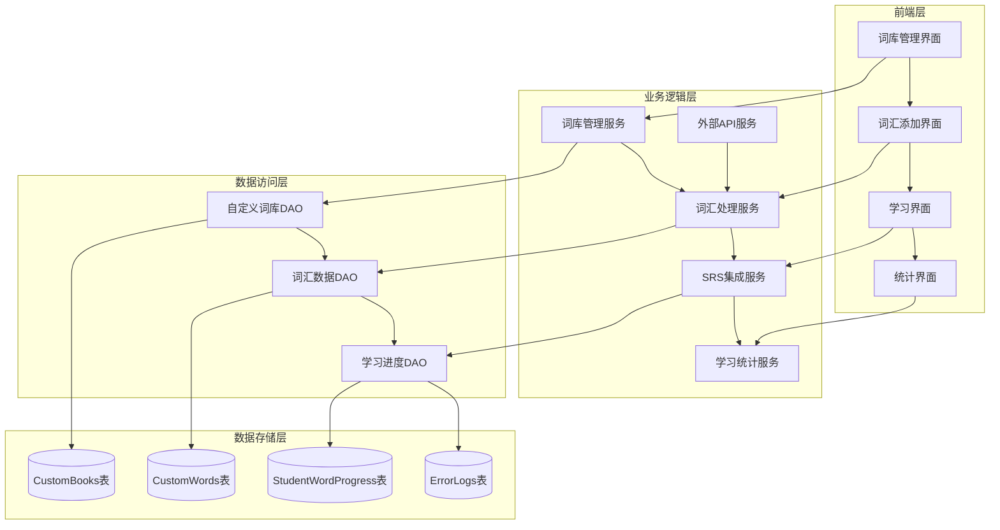

# 自定义词库功能设计文档

## 概述

自定义词库功能是对现有词汇训练系统的重要扩展，允许学生创建个人词汇集合并集成到现有的SRS学习循环中。该功能采用模块化设计，与现有系统无缝集成，支持多种学习场景和设备。

设计遵循现有系统的架构模式，使用Flask框架、SQLite数据库，并充分利用现有的SRS算法和学习模式。

## 架构

### 系统架构图



### 模块划分

1. **词库管理模块** - 处理自定义词库的CRUD操作
2. **词汇处理模块** - 处理词汇添加、词卡生成和外部API集成
3. **SRS集成模块** - 将自定义词汇集成到现有SRS系统
4. **学习统计模块** - 提供学习进度和统计分析
5. **导入导出模块** - 处理词库的导入导出功能

## 组件和接口

### 数据库设计

#### 自定义词库表 (CustomBooks)
```sql
CREATE TABLE CustomBooks (
    book_id INTEGER PRIMARY KEY AUTOINCREMENT,
    user_id INTEGER NOT NULL,
    book_name TEXT NOT NULL,
    description TEXT,
    category TEXT DEFAULT 'general',
    created_date TEXT DEFAULT (datetime('now')),
    updated_date TEXT DEFAULT (datetime('now')),
    is_active INTEGER DEFAULT 1,
    FOREIGN KEY (user_id) REFERENCES Users(id),
    UNIQUE(user_id, book_name)
);
```

#### 自定义词汇表 (CustomWords)
```sql
CREATE TABLE CustomWords (
    word_id INTEGER PRIMARY KEY AUTOINCREMENT,
    book_id INTEGER NOT NULL,
    spelling TEXT NOT NULL,
    meaning_cn TEXT,
    meaning_en TEXT,
    pos TEXT,
    pronunciation TEXT,
    example_sentence TEXT,
    example_translation TEXT,
    audio_path TEXT,
    image_path TEXT,
    source_context TEXT,
    added_date TEXT DEFAULT (datetime('now')),
    is_active INTEGER DEFAULT 1,
    FOREIGN KEY (book_id) REFERENCES CustomBooks(book_id),
    UNIQUE(book_id, spelling)
);
```

#### 词汇标签表 (WordTags)
```sql
CREATE TABLE WordTags (
    tag_id INTEGER PRIMARY KEY AUTOINCREMENT,
    word_id INTEGER NOT NULL,
    tag_name TEXT NOT NULL,
    tag_color TEXT DEFAULT '#007bff',
    FOREIGN KEY (word_id) REFERENCES CustomWords(word_id)
);
```

### API接口设计

#### 词库管理接口

**创建词库**
```
POST /api/custom-books
Content-Type: application/json

{
    "book_name": "课堂生词本",
    "description": "英语课堂学习的生词",
    "category": "classroom"
}

Response: {
    "success": true,
    "book_id": 123,
    "message": "词库创建成功"
}
```

**获取词库列表**
```
GET /api/custom-books?user_id=1

Response: {
    "success": true,
    "books": [
        {
            "book_id": 123,
            "book_name": "课堂生词本",
            "description": "英语课堂学习的生词",
            "category": "classroom",
            "word_count": 45,
            "created_date": "2025-01-15",
            "last_studied": "2025-01-20"
        }
    ]
}
```

#### 词汇管理接口

**添加词汇**
```
POST /api/custom-words
Content-Type: application/json

{
    "book_id": 123,
    "spelling": "serendipity",
    "meaning_cn": "意外发现珍奇事物的能力",
    "source_context": "阅读理解文章第二段"
}

Response: {
    "success": true,
    "word_id": 456,
    "generated_content": {
        "pronunciation": "/ˌserənˈdɪpəti/",
        "pos": "noun",
        "example_sentence": "The discovery was pure serendipity.",
        "example_translation": "这个发现纯属意外收获。"
    }
}
```

**批量添加词汇**
```
POST /api/custom-words/batch
Content-Type: application/json

{
    "book_id": 123,
    "words": [
        {"spelling": "word1", "meaning_cn": "释义1"},
        {"spelling": "word2", "meaning_cn": "释义2"}
    ]
}

Response: {
    "success": true,
    "added_count": 2,
    "failed_words": [],
    "details": [...]
}
```

#### 学习接口

**获取学习词汇**
```
GET /api/custom-learning/words?book_id=123&mode=recognition&limit=20

Response: {
    "success": true,
    "words": [
        {
            "word_id": 456,
            "spelling": "serendipity",
            "meaning_cn": "意外发现珍奇事物的能力",
            "srs_info": {
                "repetitions": 0,
                "interval": 1,
                "next_review_date": "2025-01-21"
            }
        }
    ],
    "session_id": "sess_123456"
}
```

### 服务层设计

#### CustomBookService
```python
class CustomBookService:
    def create_book(self, user_id: int, book_data: dict) -> dict:
        """创建自定义词库"""
        pass
    
    def get_user_books(self, user_id: int) -> list:
        """获取用户的所有词库"""
        pass
    
    def update_book(self, book_id: int, book_data: dict) -> bool:
        """更新词库信息"""
        pass
    
    def delete_book(self, book_id: int) -> bool:
        """删除词库（软删除）"""
        pass
```

#### CustomWordService
```python
class CustomWordService:
    def add_word(self, book_id: int, word_data: dict) -> dict:
        """添加单词到词库"""
        pass
    
    def batch_add_words(self, book_id: int, words_data: list) -> dict:
        """批量添加单词"""
        pass
    
    def generate_word_content(self, spelling: str) -> dict:
        """调用外部API生成词汇内容"""
        pass
    
    def update_word(self, word_id: int, word_data: dict) -> bool:
        """更新单词信息"""
        pass
```

#### SRSIntegrationService
```python
class SRSIntegrationService:
    def initialize_word_progress(self, user_id: int, word_id: int) -> bool:
        """初始化词汇的SRS进度"""
        pass
    
    def get_due_words(self, user_id: int, book_id: int = None) -> list:
        """获取需要复习的词汇"""
        pass
    
    def update_learning_progress(self, user_id: int, word_id: int, 
                               is_correct: bool, difficulty: int) -> bool:
        """更新学习进度"""
        pass
```

## 数据模型

### 词库数据模型
```python
@dataclass
class CustomBook:
    book_id: int
    user_id: int
    book_name: str
    description: str
    category: str
    created_date: datetime
    updated_date: datetime
    is_active: bool
    word_count: int = 0
    last_studied: datetime = None
```

### 词汇数据模型
```python
@dataclass
class CustomWord:
    word_id: int
    book_id: int
    spelling: str
    meaning_cn: str
    meaning_en: str = None
    pos: str = None
    pronunciation: str = None
    example_sentence: str = None
    example_translation: str = None
    audio_path: str = None
    image_path: str = None
    source_context: str = None
    added_date: datetime
    is_active: bool = True
    tags: List[str] = None
```

### SRS进度数据模型
```python
@dataclass
class WordProgress:
    user_id: int
    word_id: int
    repetitions: int = 0
    interval: int = 1
    next_review_date: date
    ease_factor: float = 2.5
    last_review_date: date = None
    total_reviews: int = 0
    correct_reviews: int = 0
```

## 错误处理

### 错误类型定义
```python
class CustomVocabularyError(Exception):
    """自定义词库功能基础异常"""
    pass

class BookNotFoundError(CustomVocabularyError):
    """词库不存在异常"""
    pass

class WordAlreadyExistsError(CustomVocabularyError):
    """词汇已存在异常"""
    pass

class ExternalAPIError(CustomVocabularyError):
    """外部API调用异常"""
    pass

class ImportFormatError(CustomVocabularyError):
    """导入格式错误异常"""
    pass
```

### 错误处理策略

1. **数据验证错误** - 返回详细的验证错误信息
2. **外部API错误** - 提供降级方案，允许手动输入
3. **数据库错误** - 记录日志，返回用户友好的错误信息
4. **并发冲突** - 使用乐观锁机制处理
5. **网络错误** - 提供离线模式支持

### 错误响应格式
```json
{
    "success": false,
    "error_code": "WORD_ALREADY_EXISTS",
    "message": "词汇已存在于当前词库中",
    "details": {
        "existing_word_id": 456,
        "book_name": "课堂生词本"
    },
    "suggestions": [
        "您可以选择更新现有词汇",
        "或者添加到其他词库中"
    ]
}
```

## 测试策略

### 单元测试
- 服务层业务逻辑测试
- 数据访问层CRUD操作测试
- SRS算法集成测试
- 外部API调用测试

### 集成测试
- 端到端词库创建流程测试
- 词汇添加和学习流程测试
- 导入导出功能测试
- 多用户并发操作测试

### 性能测试
- 大量词汇添加性能测试
- 学习会话响应时间测试
- 数据库查询优化验证
- 移动端响应性能测试

### 用户体验测试
- 界面易用性测试
- 移动端适配测试
- 离线功能测试
- 错误场景用户体验测试

## 安全考虑

### 数据安全
- 用户数据隔离：确保用户只能访问自己的词库
- 输入验证：防止SQL注入和XSS攻击
- 文件上传安全：限制文件类型和大小
- 数据备份：定期备份用户自定义数据

### 访问控制
- 基于会话的身份验证
- API接口权限验证
- 词库访问权限控制
- 管理员功能权限分离

### 隐私保护
- 个人词库数据加密存储
- 学习记录隐私保护
- 导出数据脱敏处理
- 符合数据保护法规要求