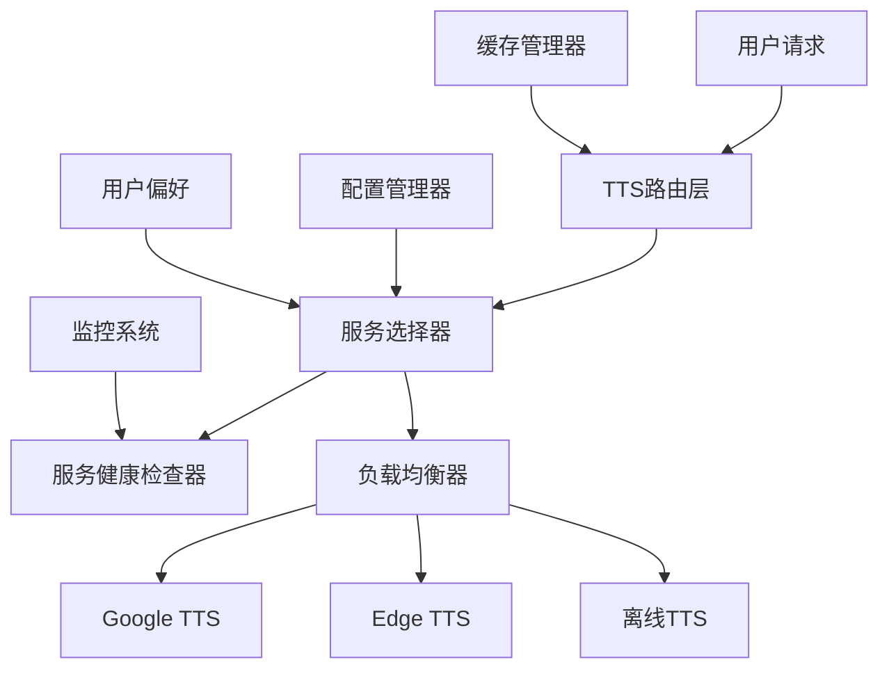

# 多源TTS服务集成设计文档

## 概述

本设计文档描述了一个多源TTS（文本转语音）服务集成系统的架构和实现方案。该系统旨在解决当前单一依赖Google TTS服务在中国境内网络环境下的可用性问题，通过集成多个国内外TTS服务提供商，实现高可用性、智能故障转移和地域适应性。

## 架构设计

### 整体架构



### 核心组件

#### 1. TTS服务管理器 (TTSServiceManager)
- 管理所有TTS服务提供商的实例
- 处理服务的注册、注销和配置更新
- 维护服务状态和优先级

#### 2. 服务选择器 (ServiceSelector)
- 根据地理位置、网络环境和用户偏好选择最优服务
- 实现智能故障转移逻辑
- 支持A/B测试和灰度发布

#### 3. 健康检查器 (HealthChecker)
- 定期检查所有TTS服务的可用性
- 监控响应时间和成功率
- 自动标记不可用服务并恢复可用服务

#### 4. 缓存管理器 (CacheManager)
- 管理音频文件的本地缓存
- 实现LRU缓存策略
- 支持缓存预热和清理

## 组件和接口设计

### 1. TTS服务抽象接口

```python
from abc import ABC, abstractmethod
from typing import Optional, Dict, Any
from dataclasses import dataclass

@dataclass
class TTSRequest:
    text: str
    language: str = 'en'
    voice: Optional[str] = None
    speed: float = 1.0
    pitch: float = 1.0
    emotion: Optional[str] = None

@dataclass
class TTSResponse:
    audio_data: bytes
    format: str
    duration: float
    metadata: Dict[str, Any]

class TTSServiceInterface(ABC):
    @abstractmethod
    async def synthesize(self, request: TTSRequest) -> TTSResponse:
        """合成语音"""
        pass
    
    @abstractmethod
    async def health_check(self) -> bool:
        """健康检查"""
        pass
    
    @abstractmethod
    def get_supported_languages(self) -> List[str]:
        """获取支持的语言列表"""
        pass
    
    @abstractmethod
    def get_supported_voices(self, language: str) -> List[str]:
        """获取指定语言的音色列表"""
        pass
```

### 2. 服务提供商实现

#### Google TTS服务
```python
class GoogleTTSService(TTSServiceInterface):
    def __init__(self, config: Dict[str, Any]):
        self.timeout = config.get('timeout', 30)
        self.slow = config.get('slow', False)
    
    async def synthesize(self, request: TTSRequest) -> TTSResponse:
        # 实现Google TTS调用逻辑
        pass
```

#### Edge TTS服务
```python
class EdgeTTSService(TTSServiceInterface):
    def __init__(self, config: Dict[str, Any]):
        self.timeout = config.get('timeout', 30)
        self.default_voice = config.get('default_voice', 'en-US-AriaNeural')
    
    async def synthesize(self, request: TTSRequest) -> TTSResponse:
        """使用Microsoft Edge TTS合成语音"""
        import edge_tts
        
        # 选择合适的音色
        voice = request.voice or self._select_voice_by_language(request.language)
        
        # 创建通信对象
        communicate = edge_tts.Communicate(
            text=request.text,
            voice=voice,
            rate=f"{int((request.speed - 1) * 100):+d}%",
            pitch=f"{int((request.pitch - 1) * 50):+d}Hz"
        )
        
        # 生成音频数据
        audio_data = b""
        async for chunk in communicate.stream():
            if chunk["type"] == "audio":
                audio_data += chunk["data"]
        
        return TTSResponse(
            audio_data=audio_data,
            format="mp3",
            duration=len(audio_data) / 16000,  # 估算时长
            metadata={"voice": voice, "service": "edge-tts"}
        )
    
    def _select_voice_by_language(self, language: str) -> str:
        """根据语言选择合适的音色"""
        voice_map = {
            'en': 'en-US-AriaNeural',
            'zh': 'zh-CN-XiaoxiaoNeural',
            'zh-CN': 'zh-CN-XiaoxiaoNeural',
            'zh-TW': 'zh-TW-HsiaoChenNeural',
            'ja': 'ja-JP-NanamiNeural',
            'ko': 'ko-KR-SunHiNeural',
            'fr': 'fr-FR-DeniseNeural',
            'de': 'de-DE-KatjaNeural',
            'es': 'es-ES-ElviraNeural'
        }
        return voice_map.get(language, self.default_voice)
    
    async def health_check(self) -> bool:
        """检查Edge TTS服务健康状态"""
        try:
            # 尝试合成一个简短的测试文本
            test_request = TTSRequest(text="test", language="en")
            await self.synthesize(test_request)
            return True
        except Exception:
            return False
    
    def get_supported_languages(self) -> List[str]:
        """获取支持的语言列表"""
        return ['en', 'zh', 'zh-CN', 'zh-TW', 'ja', 'ko', 'fr', 'de', 'es']
    
    def get_supported_voices(self, language: str) -> List[str]:
        """获取指定语言的音色列表"""
        # Edge TTS支持300+音色，这里列出常用的
        voice_lists = {
            'en': [
                'en-US-AriaNeural', 'en-US-JennyNeural', 'en-US-GuyNeural',
                'en-GB-SoniaNeural', 'en-GB-RyanNeural', 'en-AU-NatashaNeural'
            ],
            'zh': [
                'zh-CN-XiaoxiaoNeural', 'zh-CN-YunyangNeural', 'zh-CN-YunyeNeural',
                'zh-TW-HsiaoChenNeural', 'zh-TW-YunJheNeural', 'zh-HK-HiuMaanNeural'
            ]
        }
        return voice_lists.get(language, [])
```

#### 离线TTS服务
```python
class OfflineTTSService(TTSServiceInterface):
    def __init__(self, config: Dict[str, Any]):
        self.engine = config.get('engine', 'pyttsx3')
        self._init_engine()
    
    def _init_engine(self):
        """初始化离线TTS引擎"""
        try:
            import pyttsx3
            self.tts_engine = pyttsx3.init()
        except ImportError:
            self.tts_engine = None
    
    async def synthesize(self, request: TTSRequest) -> TTSResponse:
        """使用离线TTS合成语音"""
        if not self.tts_engine:
            raise ServiceUnavailableError("离线TTS引擎不可用")
        
        # 设置语音参数
        self.tts_engine.setProperty('rate', int(200 * request.speed))
        
        # 生成临时文件
        import tempfile
        with tempfile.NamedTemporaryFile(suffix='.wav', delete=False) as temp_file:
            temp_path = temp_file.name
        
        # 保存音频
        self.tts_engine.save_to_file(request.text, temp_path)
        self.tts_engine.runAndWait()
        
        # 读取音频数据
        with open(temp_path, 'rb') as f:
            audio_data = f.read()
        
        # 清理临时文件
        import os
        os.unlink(temp_path)
        
        return TTSResponse(
            audio_data=audio_data,
            format="wav",
            duration=len(request.text) * 0.1,  # 估算时长
            metadata={"service": "offline-tts"}
        )
```

### 3. 服务管理器

```python
class TTSServiceManager:
    def __init__(self, config_manager: ConfigManager):
        self.services: Dict[str, TTSServiceInterface] = {}
        self.config_manager = config_manager
        self.health_checker = HealthChecker()
        self.service_selector = ServiceSelector()
    
    def register_service(self, name: str, service: TTSServiceInterface):
        """注册TTS服务"""
        self.services[name] = service
    
    async def synthesize(self, request: TTSRequest) -> TTSResponse:
        """合成语音，自动选择最优服务"""
        selected_service = await self.service_selector.select_service(
            request, self.services
        )
        return await selected_service.synthesize(request)
    
    def get_service_status(self) -> Dict[str, Dict[str, Any]]:
        """获取所有服务的状态"""
        return self.health_checker.get_all_status()
```

### 4. 服务选择器

```python
class ServiceSelector:
    def __init__(self):
        self.geo_detector = GeoLocationDetector()
        self.performance_tracker = PerformanceTracker()
    
    async def select_service(
        self, 
        request: TTSRequest, 
        services: Dict[str, TTSServiceInterface]
    ) -> TTSServiceInterface:
        """选择最优的TTS服务"""
        
        # 1. 过滤可用服务
        available_services = self._filter_available_services(services)
        
        # 2. 根据地理位置优化
        geo_optimized = self._optimize_by_geography(available_services)
        
        # 3. 根据性能指标排序
        performance_sorted = self._sort_by_performance(geo_optimized)
        
        # 4. 应用用户偏好
        final_selection = self._apply_user_preferences(performance_sorted)
        
        return final_selection[0] if final_selection else None
```

## 数据模型

### 1. TTS服务配置表

```sql
CREATE TABLE tts_service_configs (
    id INTEGER PRIMARY KEY AUTOINCREMENT,
    service_name VARCHAR(50) NOT NULL UNIQUE,
    service_type VARCHAR(20) NOT NULL, -- 'google', 'edge', 'offline'
    config_json TEXT NOT NULL,
    priority INTEGER DEFAULT 0,
    enabled BOOLEAN DEFAULT TRUE,
    region VARCHAR(10) DEFAULT 'global', -- 'cn', 'us', 'global'
    created_at TIMESTAMP DEFAULT CURRENT_TIMESTAMP,
    updated_at TIMESTAMP DEFAULT CURRENT_TIMESTAMP
);
```

### 2. 服务健康状态表

```sql
CREATE TABLE tts_service_health (
    id INTEGER PRIMARY KEY AUTOINCREMENT,
    service_name VARCHAR(50) NOT NULL,
    status VARCHAR(20) NOT NULL, -- 'healthy', 'unhealthy', 'degraded'
    response_time_ms INTEGER,
    success_rate DECIMAL(5,2),
    last_check_at TIMESTAMP DEFAULT CURRENT_TIMESTAMP,
    error_message TEXT,
    FOREIGN KEY (service_name) REFERENCES tts_service_configs(service_name)
);
```

### 3. 用户TTS偏好表

```sql
CREATE TABLE user_tts_preferences (
    id INTEGER PRIMARY KEY AUTOINCREMENT,
    user_id INTEGER,
    preferred_service VARCHAR(50),
    voice_preference VARCHAR(50),
    speed_preference DECIMAL(3,1) DEFAULT 1.0,
    pitch_preference DECIMAL(3,1) DEFAULT 1.0,
    language_preference VARCHAR(10) DEFAULT 'en',
    created_at TIMESTAMP DEFAULT CURRENT_TIMESTAMP,
    updated_at TIMESTAMP DEFAULT CURRENT_TIMESTAMP
);
```

### 4. TTS使用统计表

```sql
CREATE TABLE tts_usage_stats (
    id INTEGER PRIMARY KEY AUTOINCREMENT,
    service_name VARCHAR(50) NOT NULL,
    request_count INTEGER DEFAULT 0,
    success_count INTEGER DEFAULT 0,
    total_response_time_ms BIGINT DEFAULT 0,
    date DATE NOT NULL,
    hour INTEGER NOT NULL,
    UNIQUE(service_name, date, hour)
);
```

## 错误处理策略

### 1. 分层错误处理

```python
class TTSError(Exception):
    """TTS基础异常类"""
    pass

class ServiceUnavailableError(TTSError):
    """服务不可用异常"""
    pass

class AuthenticationError(TTSError):
    """认证失败异常"""
    pass

class QuotaExceededError(TTSError):
    """配额超限异常"""
    pass

class NetworkTimeoutError(TTSError):
    """网络超时异常"""
    pass
```

### 2. 故障转移策略

```python
class FailoverStrategy:
    async def handle_failure(
        self, 
        failed_service: str, 
        error: Exception,
        available_services: List[str]
    ) -> Optional[str]:
        """处理服务失败，返回备用服务"""
        
        if isinstance(error, NetworkTimeoutError):
            # 网络超时：选择地理位置更近的服务
            return self._select_nearest_service(available_services)
        
        elif isinstance(error, QuotaExceededError):
            # 配额超限：选择不同提供商的服务
            return self._select_different_provider(failed_service, available_services)
        
        elif isinstance(error, AuthenticationError):
            # 认证失败：标记服务为不可用，选择其他服务
            self._mark_service_unavailable(failed_service)
            return self._select_next_priority_service(available_services)
        
        else:
            # 其他错误：按优先级选择下一个服务
            return self._select_next_priority_service(available_services)
```

### 3. 降级策略

```python
class DegradationStrategy:
    def __init__(self):
        self.offline_tts = OfflineTTSService()
    
    async def degrade_gracefully(self, request: TTSRequest) -> TTSResponse:
        """优雅降级处理"""
        
        # 1. 尝试使用缓存的音频
        cached_audio = await self._try_cache(request)
        if cached_audio:
            return cached_audio
        
        # 2. 使用离线TTS服务
        try:
            return await self.offline_tts.synthesize(request)
        except Exception:
            pass
        
        # 3. 返回静默音频或错误提示
        return self._generate_fallback_response(request)
```

## 测试策略

### 1. 单元测试

```python
class TestTTSServiceManager:
    def test_service_registration(self):
        """测试服务注册功能"""
        pass
    
    def test_service_selection(self):
        """测试服务选择逻辑"""
        pass
    
    def test_failover_mechanism(self):
        """测试故障转移机制"""
        pass
```

### 2. 集成测试

```python
class TestTTSIntegration:
    def test_google_tts_integration(self):
        """测试Google TTS集成"""
        pass
    
    def test_edge_tts_integration(self):
        """测试Edge TTS集成"""
        pass
    
    def test_offline_tts_integration(self):
        """测试离线TTS集成"""
        pass
    
    def test_service_failover(self):
        """测试服务故障转移"""
        pass
```

### 3. 性能测试

```python
class TestTTSPerformance:
    def test_concurrent_requests(self):
        """测试并发请求处理"""
        pass
    
    def test_response_time(self):
        """测试响应时间"""
        pass
    
    def test_cache_performance(self):
        """测试缓存性能"""
        pass
```

### 4. 网络环境测试

```python
class TestNetworkEnvironments:
    def test_china_network_environment(self):
        """测试中国网络环境下的服务选择"""
        pass
    
    def test_international_network_environment(self):
        """测试国际网络环境下的服务选择"""
        pass
    
    def test_network_failure_scenarios(self):
        """测试网络故障场景"""
        pass
```

## 部署和配置

### 1. 配置文件结构

```yaml
# tts_config.yaml
tts:
  default_language: "en"
  default_voice: "neutral"
  cache:
    enabled: true
    max_size_mb: 500
    ttl_hours: 24
  
  services:
    google:
      enabled: true
      priority: 2
      timeout: 30
      slow: false
      regions: ["global"]
    
    edge:
      enabled: true
      priority: 1
      timeout: 30
      default_voice: "en-US-AriaNeural"
      regions: ["global", "cn"]
    
    offline:
      enabled: true
      priority: 3
      engine: "pyttsx3"
      regions: ["local"]
  
  health_check:
    interval_seconds: 60
    timeout_seconds: 10
    failure_threshold: 3
    recovery_threshold: 2
  
  monitoring:
    enabled: true
    metrics_retention_days: 30
    alert_thresholds:
      response_time_ms: 5000
      success_rate_percent: 95
```

### 2. 环境变量配置

```bash
# TTS服务配置 - 主要使用免费服务
# Google TTS - 无需额外配置，使用gTTS库
# Edge TTS - 无需API密钥，免费使用
# 离线TTS - 本地服务，无需网络

# 地理位置检测
GEO_DETECTION_ENABLED=true
DEFAULT_REGION=auto

# 监控配置
MONITORING_ENABLED=true
METRICS_ENDPOINT=/metrics

# 缓存配置
TTS_CACHE_ENABLED=true
TTS_CACHE_MAX_SIZE_MB=500
TTS_CACHE_TTL_HOURS=24
```

## 监控和运维

### 1. 关键指标监控

- **可用性指标**：各服务的健康状态和可用率
- **性能指标**：响应时间、吞吐量、并发数
- **质量指标**：音频质量评分、用户满意度
- **成本指标**：各服务的使用量和费用

### 2. 告警规则

```python
ALERT_RULES = {
    'service_down': {
        'condition': 'service_health == "unhealthy"',
        'duration': '5m',
        'severity': 'critical'
    },
    'high_response_time': {
        'condition': 'avg_response_time > 5000',
        'duration': '2m',
        'severity': 'warning'
    },
    'low_success_rate': {
        'condition': 'success_rate < 0.95',
        'duration': '3m',
        'severity': 'warning'
    }
}
```

### 3. 运维工具

```python
class TTSOperationTools:
    def force_service_switch(self, from_service: str, to_service: str):
        """强制切换服务"""
        pass
    
    def update_service_priority(self, service: str, priority: int):
        """更新服务优先级"""
        pass
    
    def clear_service_cache(self, service: str = None):
        """清理服务缓存"""
        pass
    
    def export_usage_report(self, start_date: str, end_date: str):
        """导出使用报告"""
        pass
```

## 安全考虑

### 1. API密钥管理
- 使用环境变量存储敏感信息
- 实现密钥轮换机制
- 加密存储配置信息

### 2. 访问控制
- 实现请求频率限制
- 添加IP白名单功能
- 记录所有API调用日志

### 3. 数据保护
- 音频文件加密存储
- 实现数据脱敏功能
- 定期清理敏感日志

这个设计文档提供了一个全面的多源TTS服务集成解决方案，能够有效解决当前系统在中国境内网络环境下的可用性问题，同时提供高质量的语音合成服务和良好的用户体验。